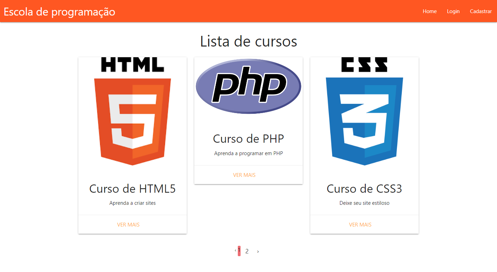

## Introdução

Este readme está dividido em:

- Introdução
- Descrição
- Funcionalidades
- Como instalar
- Imagem

## Descrição

Trata-se de um sistema desenvolvido em Laravel 5.3 para fins didáticos onde o usuário pode fazer login/cadastro, sendo direcionado para uma área protegida por autenticação onde ele pode inserir, alterar e deletar cursos de programação. O sistema é responsivo, fazendo uso do framework Materialize. As senhas são criptografadas.

## Funcionalidades

Tela de Home: na tela de home temos uma lista de cards contendo cursos de programaçao. Esses cursos são listados diretamente do banco.

Tela de Login: ao realizar o login, se colocar senha ou email errado, o usuário é redirecionado para a 'home' e uma flash message será exibida e desaparecerá 3 segundos depois. Se o login ocorrer com sucesso, o usuário é redirecionado para a página de admin onde será possível adicionar, editar e remover cursos. Aqui também é exibida uma flash message de 3 segundos de duração.
Se você realizar um novo cadastro e depois fizer o login, a página de admin não vai listar nenhum curso pois esse novo usuário ainda não adicionou nenhum curso. Ou seja, os cursos são exibidos de acordo com cada usuário logado no sistema.

Tela de admin: na página de admin o menu é alterado, contendo a opção "Cursos" e o nome da pessoa logada no sistema.

Tela de Cadastro de usuário: ao cadastrar, o usuário é redirecionado para a home e uma mensagem de flash message será exibida informando que o usuário se cadastrou com sucesso e desaparecerá 3 segundos depois. Se o usuário já for cadastrado, ele vai verificar pelo email e vai atualizar o nome a senha nova que foram digitadas. Também vai redirecionar o usuário para a página home com uma flash message de sucesso de 3 segundos. As senhas são criptografadas.

Adicionar / Editar um curso: após logado, é possível adicionar e editar cursos e as informações do curso. No campo "publicação", se não for selecionado o checkbox, o curso não será publicado na página Home. Se for selecionado, ele será postado na página Home.

Deletar curso: ao clicar em deletar curso, ele será deletado na tabela do banco e consequentemente da página Home.

## Como instalar

Você vai precisar:
- [Wampserver](https://www.wampserver.com/en/)
- [Composer](https://getcomposer.org/)

O Wampserver vai simular um host local em sua máquina. Com ele também vem junto o MySQLWorkbench, onde vamos importar nosso banco de dados.

O Composer é um gerenciador de dependências do PHP.

Para instalar o Wampserver siga este [tutorial](https://www.devmedia.com.br/instalacao-do-wampserver/25871)

Após baixar e instalar o Composer, verifique se ele está nas variáveis de ambiente do sistema. Para verificar isso, abra o cmd, digite "composer" e dê enter. Se aparecer uma tela com a versão e os comandos, ele já está configurado. Caso contrário: no Windows 10, basta abrir o Menu Iniciar e digitar "variáveis". Depois clique em "Variáveis de ambiente"; depois em "Variáveis do sistema" dê um duplo clique em "Path", clique em "Novo" e digite o local onde ele foi instalado, por exemplo: "C:\ProgramData\ComposerSetup\bin". Depois basta clicar em 'ok' ou 'aplicar'.

Após instalar o Wampserver, abra seu navegador e digite "localhost" para ver se está tudo ok.

Clone o projeto para sua máquina, na pasta "C:\wamp64\www". Abra o terminal na pasta que você acabou de clonar e digite o comando:
> composer install

Agora, acesse este [tutorial](https://www.visualdicas.com.br/index.php/tools/web-server/4-como-alterar-um-servidor-virtual-wamp-server) para configurar o virtual host do Wamp.

Abra seu MySQLWorkbench e importe o arquivo de dump chamado "dump-escola-programacao" localizado na pasta
> public/dump

Nesse arquivo temos 5 cursos de exemplo e 1 conta de usuário que você pode usar para fazer login no sistema, basta digitar "admin@teste.com" no campo email e "123" no campo senha. 

Depois de configurar o Virtual host e de importar o banco, acesse "http://localhost/projeto-escola-de-programacao/" e clique em "public".

Se der um erro na exibição da página, renomeie o arquivo ".env.example" para ".env" e digite o comando (na pasta raíz do projeto):
> php artisan key:generate

Se você renomeou o ".env.example" para ".env", digite neste ".env" o seguinte: "DB_DATABASE=son_laravel_55", "DB_USERNAME=root", "DB_PASSWORD=".

## Imagem do Projeto

Para mais imagens, acesse a pasta
> public/img

Página home:

